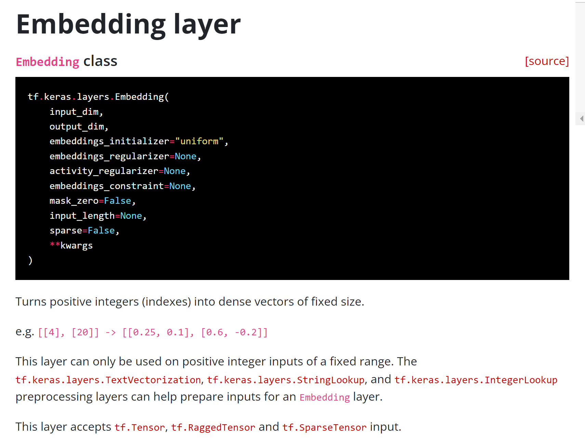
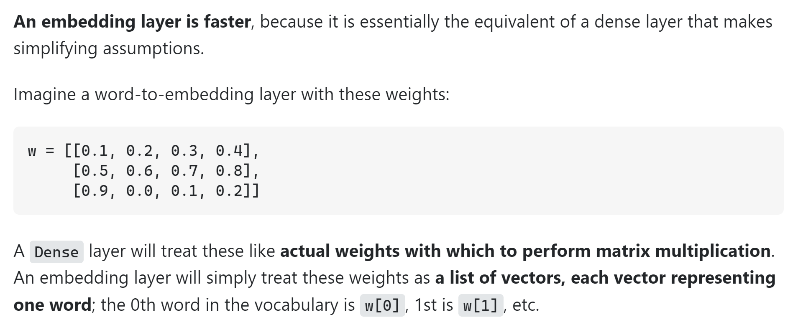

### PyTorch notes

```
x = torch.from_numpy(np.array([
    [
        [4,5,6],
        [7,8,9],
    ],
    [
        [10,9,12],
        [13,14,15],
    ],
])).float()

x = torch.from_numpy(np.array([
    [4,5,6],
    [7,8,9],
])).float()

torch.nn.Softmax(dim=n)(x)
# dim=-1 is along rows
# dim=-2 is along columns
# dim=-3 is along batches
```

### HF transformers

```
tokenizer(...).input_ids
model.generate(...)[0]
model(...).logits
```

### Keras

Keras Embedding layer takes just one integer (token index) as input


[StackOverflow](https://stackoverflow.com/questions/47868265/what-is-the-difference-between-an-embedding-layer-and-a-dense-layer)


When we use embedding layer, it is generally to reduce one-hot input vectors (sparse) to denser representations.

1. Embedding layer is much like a table lookup. When the table is small, it is fast.
2. When the table is large, table lookup is much slower. In practice, we would use dense layer as a dimension reducer to
   reduce the one-hot input instead of embedding layer in this case.

#### Metrics

categorical_crossentropy y_true is one-hot vector or maybe a softmax vector
sparse_categorical_crossentropy y_true is just an index of a category
y_pred softmax vector, unless from_logits is set

#### SGD, batch_size

A smaller batch_size + more training steps can be more accurate than a bigger batch_size + fewer updates.

There are several ways to understand why several updates is better (for the same amount of data being read). It's the
key idea of stochastic gradient descent vs. gradient descent. Instead of reading everything and then correct yourself at
the end, you correct yourself on the way, making the next reads more useful since you correct yourself from a better
guess. Geometrically, several updates is better because you are drawing several segments, each in the direction of the (
approximated) gradient at the start of each segment. while a single big update is a single segment from the very start
in the direction of the (exact) gradient. It's better to change direction several times even if the direction is less
precise.

#### Misc

Displaying layer activations:

```python
import matplotlib.pyplot as plt
import numpy as np


def plot_conv(epoch=0, batch=0, accuracy=0):
    plt.ioff()

    img_indices = [0, 23, 28, 900, 1500, 5000, 7000]
    convolution_indices = [1, 5, 10, 20]
    f, axarr = plt.subplots(len(img_indices) + len(convolution_indices) - 1, len(model.layers) + 1)

    for ax in axarr:
        for plot in ax:
            plot.grid(False)
            plot.axis('off')

    f.set_figheight(len(img_indices) + len(convolution_indices) - 1)
    f.set_figwidth(len(model.layers) + 1)

    layer_outputs = [layer.output for layer in model.layers]
    activation_model = tf.keras.models.Model(inputs=model.input, outputs=layer_outputs)

    def draw_plot(plot, img):
        plot.imshow(img, cmap='inferno')

    for ax, img_index in enumerate(img_indices):
        ax_index = ax if ax == 0 else (ax + len(convolution_indices) - 1)
        draw_plot(axarr[ax_index, 0], test_images[img_index])
        prediction = activation_model.predict(test_images[img_index].reshape(1, 28, 28, 1), verbose="2")
        for layer_index, _ in enumerate(model.layers):
            if len(prediction[layer_index].shape) == 4:
                for convolution_index_index, convolution_index in enumerate(
                        convolution_indices[:(len(convolution_indices) if ax == 0 else 1)]):
                    draw_plot(axarr[ax_index + convolution_index_index, layer_index + 1],
                              prediction[layer_index][0, :, :, convolution_index])
            else:
                img = np.tile(prediction[layer_index][0], (len(prediction[layer_index][0]), 1))
                draw_plot(axarr[ax_index, layer_index + 1], img)

    f.suptitle(f"Epoch: {epoch:02d}, batch: {batch:04d}, accuracy: {accuracy:06.3f}", fontsize=14)
    f.savefig(f"../../../tmp/charts/plot-{epoch:02d}-{batch:04d}.png")
    plt.close('all')


plot_conv()
```

Note: it may be useful to normalize images (code taken from the lab)

```python
for i in range(n_features):
    x = feature_map[0, :, :, i]
    x -= x.mean()
    x /= x.std()
    x *= 64
    x += 128
    x = np.clip(x, 0, 255).astype('uint8')
```

TF tensor shape is `tensorflow.python.framework.tensor_shape.TensorShape`, it has .as_list() method  \
NumPy shape is a tuple  \
Conv2D output is of shape (batch_dimension, H, W, n_filters)  \
To reshape to unspecified batch dimension, specify -1: `test_images[img_index].reshape(-1, 28, 28, 1)`  \
tensor.numpy()  \
`model.predict(x)` is for batch prediction, while `model(x)` can be more efficient in loops  \
ndarray.tolist()  \
`prediction[layer_index][0, :, :, CONVOLUTION_NUMBER]` - here among 4 dimensions the 1st and 4th are fixed and 2nd and
3rd are left, and the result is a 2d array  \
numpy.expand_dims = pytorch unsqueeze:  `np.expand_dims(training_images, axis=3)` or axis=(3,4) or axis=-1  \
`ndarray / 255.0` if ndarray is of shape (..., ..., ..., 1) then the last dimension is removed for some reason \

```
from tf.keras.utils import load_img, img_to_array

img = load_img(path, target_size=(300, 300))
x = img_to_array(img)

# Also: image_dataset_from_directory, save_img
```

```
tf.keras.callbacks.EarlyStopping
tf.keras.callbacks.ModelCheckpoint
tf.keras.callbacks.LearningRateScheduler for finding the best stable optimizer step

img = mpimg.imread(img_path)
plt.imshow(img)

dataset.padded_batch(batch_size)
```

NLP:  \
Surprisingly, even a simple Conv1D (not LSTM or transformer, etc.) can be applied to next word prediction task, although
attention window would be limited and the order of words might be ignored

np.allclose Returns True if two arrays are element-wise equal within a tolerance

```
dataset = tf.data.Dataset.from_tensor_slices(series)
dataset = dataset.window(window_size + 1, shift=1, drop_remainder=True)
dataset = dataset.flat_map(lambda window: window.batch(window_size + 1))
dataset = dataset.shuffle(shuffle_buffer)
dataset = dataset.map(lambda window: (window[:-1], window[-1]))
dataset = dataset.batch(batch_size).prefetch(1)
```

Time series:

- better to split train/val according to periodicity of data
- baseline is centered_moving_average(past) + moving_average(period - previous period)
- a simple linear regression (Dense(1)) can do as well as the baseline

TF lambda layers (not supported in HDF5 format)

tf.expand_dims - similar to np.expand_dims

Time series:

- better to split train/val according to periodicity of data
- baseline is past moving average + (period - previous period moving average)
- a simple linear regression (Dense(1)) can do as well as the baseline
